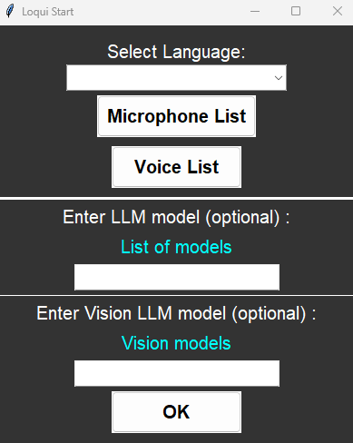

# Loqui


Application allowing you to configure a text and a voice response, also allows you to open your applications with a chosen text trigger.


## Installation

The fastest way is to clone the repository and click on the **'start-app.bat'** and the application will **launch and make the installation automatically**.

If you want to run the code from your code environment, do this :

=> You need to install **Python 3.11**

1-/ Clone this repository ```git clone https://github.com/nixiz0/DrawItium.git```

2-/ Create your environment ```python -m venv .env```

3-/ Download required libraries ```pip install -r requirements.txt```

4-/ Run the main.py ```python main.py```


## Installation to launch assistant when your computer starts (on Windows)

- Pressed "Windows" + R

- Write "shell:startup"

- Copy and paste the "start-app.bat" on this folder

- Rename the file "assistant-auto"

- Open the "assistant-auto.bat" that you have renamed

- On the first "cd" put the absolute path for the 'Scripts' instead of the relative path, 
**for example** you change "cd .env\Scripts" to "C:\Users\YOU\Desktop\Loqui\.env\Scripts"

And now the script will start as soon as your computer starts.


## Loqui Add Data


**{Be careful to put the trigger sentences in lowercase without punctuation !}**

To add the text trigger and response for this text you want to the model you must :
- Put in **'Trigger Phrase'** the sentence that you want for trigger the model.
- Put in **'Response'** the response you want the pattern to say after saying the trigger phrase.
- Don't forget to **'Submit'** to put the data on the model.

To add an Application you must :
- Click on the **Add Application** button then in the file explorer you must search for the application or file you want to launch.
- In the **'Application Key'** input you will have the name of this application which will serve as a trigger phrase.
- If you want to change this name with a phrase or word that you want to use to trigger the opening of the application by saying this word orally, you just have to mark the new name you want in **'New Key Name'** and click on the **'Rename'** button to save the modification.

Information on **.bat autorun** :
- The first time you click on the 'Start' button and put your parameters, it will create a **params.txt** file which will update if you change the parameters and this will ensure that when you run your .bat, it will automatically start the model without you needing to put your settings back.
- If you want to remodify the saved parameters you just have to start the main.py and reconfigure your parameters or you can delete the params.txt and it will automatically reopen the main.py menu and you click 'Start' and set your new settings.

Note: if you plug other components into your USB devices and others, it's possible that the micro index etc defined by default changes given the connection or unplugging of the device, so please after each connection or unplugging on your computer redefine the devices that you want to use.


## Loqui Start the Model


To launch the model you must :
- Select a Language, it's important because if you select the wrong language the voice recognition algorithm will not recognize the words well.
- By default the main microphone used by Windows will be used but you can choose from all your microphones (if you have several) the one you want to use to speak with.
- You can choose from the list of your synthetic voices that are in your operating system the voice you want to use.
- (Optional) If you have installed Ollama and run the API server on your machine (click on 'Local LLM Guide' button on the menu if you don't know how to do this), you can put the name of a model that you have locally and use it later with a commands voice (check bellow to see the trigger sentences for activate the local LLM and for desactivate him)
- (Optional) If you have installed Ollama and run the API server on your machine (click on 'Local LLM Guide' button on the menu if you don't know how to do this), you can put the name of a vision model that you have locally and use it later with a commands voice (check bellow to see the trigger sentences for activate the vision LLM and for desactivate him)


## To have more Synthetic Voices Available (on Windows)


If you want to have more synthetic voices available, on Windows you have to go to the narrator settings and you can download the voices you want.

If this doesn't work and doesn't recognize the voices you have installed on the narrator settings, follow this steps :
1. Open the **Registry Editor** by pressing the **“Windows” and “R”** keys simultaneously, then type **“regedit”** and press Enter.

2. Navigate to the registry key : **HKEY_LOCAL_MACHINE\SOFTWARE\Microsoft\Speech_OneCore\Voices\Tokens**.

3. Export this key to a **REG file** (with a right click on the file).

4. Open this file with a text editor and replace all occurrences of **HKEY_LOCAL_MACHINE\SOFTWARE\Microsoft\Speech_OneCore\Voices\Tokens** 
with **HKEY_LOCAL_MACHINE\SOFTWARE\Microsoft\SPEECH\Voices\Tokens**.

5. Save the modified file and double-click it to import the changes to the registry.


## Commands

Press the * key on your keyboard to pause the conversation and press the * key again to starts again the conversation.

For the local LLM you can also by pressing * pause the conversation but be careful after a moment for reasons of performance optimization the local LLM of Ollama will turn off and therefore when you go to use it again it will take a little time to initialize.


## Vocal Commands

The application integrates several features allowing you to execute commands with voice recognition, here are all the commands and their trigger phrases that you can use :

**Launch Local LLM (use Ollama):**  
['passe en mode précision', 'passe en précision', 'passage en mode précision', 'switch to precision mode', 'switch to precision']

**Save conversation with the LLM in text:**  
['sauvegarde notre discussion', 'sauvegarde notre conversation', 'sauvegarde la discussion', 'sauvegarde la conversation', 'save our discussion', 'save our conversation', 'save the discussion', 'save the conversation']

**Launch Vision LLM (use Ollama):**  
['passe en mode analyse', 'passe en analyse', 'passage en mode analyse', 'switch to analysis mode', 'switch to analysis', 'switch to analyse mode', 'switch to analyse']

**Screenshot of your Desktop for Vision LLM:**  
['screenshot', 'screen']

**Camera for Vision LLM:**  
['camera', 'caméra', 'cam']

**Deactivate LLM and LLM vision to return to classic detection:**  
['désactive llm', 'passe en mode classique', 'passage en mode classique', 'disable llm', 'switch to classic mode', 'switch classic mode']

**Open Text Edit and take note (file saved in your Desktop):**  
['prends note', 'take note']

**Calcul (addition, subtraction, multiplication and division):**  
['calcule', 'calcul', 'compute', 'calculate']

**Start the chronometer:**   
['démarre le chronomètre', 'start the chronometer']

**Stop the chronometer:**   
['arrête le chronomètre', 'stop the chronometer']

**Start a video (with your webcam):**   
You will be asked if you wish to modify the video parameters, you can in particular choose to use another webcam, remember that if you have one webcam then you must say 0, if you have two and you want to use the second then you have to say 1 etc    
['je veux que tu filmes', 'commence une vidéo', 'i want you to film', 'start video', 'start a video']  

**Launch and search on YouTube if you say:**  
['recherche sur youtube', 'find on youtube', 'find in youtube']

**on Google:**  
['recherche sur google', 'find on google', 'find in google']

**on Wikipedia:**  
['recherche sur wikipédia', 'find on wikipedia', 'find in wikipedia']

**on Bing:**  
['recherche sur bing', 'find on bing', 'find in bing']

**Launch Chat-GPT:**  
['ouvre chat ia', 'recherche sur chat ia', 'search on ai chat', 'search in ai chat', 'start ai chat']

**Gives you the current Time:**  
['quelle heure est-il', 'l\'heure actuelle', 'what time is it']

**Gives you the current Date:**  
['date actuelle', 'date d\'aujourd\'hui', 'current date', 'today\'s date', 'date of today']

**Gives you info on your IP Address:**  
['quel est mon ip', 'mon ip', 'my ip', 'what is my ip', 'what\'s my ip']

**Gives you info on your system:**  
['informations sur mon système', 'informations système', 'informations of my system', 'informations system']

**Mute Volume in your computer:**  
['mute', 'silence']

**DeMute Volume:**  
['des mute', 'remets le volume', 'demute', 'de mute']

**Increases Volume:**  
['augmente le volume', 'monte le volume', 'increase the volume']

**Decreases Volume:**  
['diminue le volume', 'descend le volume', 'decreases the volume']

**Pause the conversation:**  
['pause']

**Stop the Conversation:**  
['stoppe notre discussion', 'stoppe notre conversation', 'stoppe la discussion', 'stoppe la conversation', 'stop our discussion', 'stop our conversation', 'stop the discussion', 'stop the conversation']


## Tech Stack

**Local AI Models:** Ollama (version 0.1.20)

**Voice Recognition:** speech_recognition

**Audio Device Scanning:** pyaudio

**Synthetic Voices:** pyttsx3

**Interface:** Tkinter

**Computer Commands:** webbrowser (search on web) / pywhatkit (search on youtube) / pycaw (change volume computer) / sympy (calcul) / keyboard (listen keyboard pressed)


## Author

- [@nixiz0](https://github.com/nixiz0)
